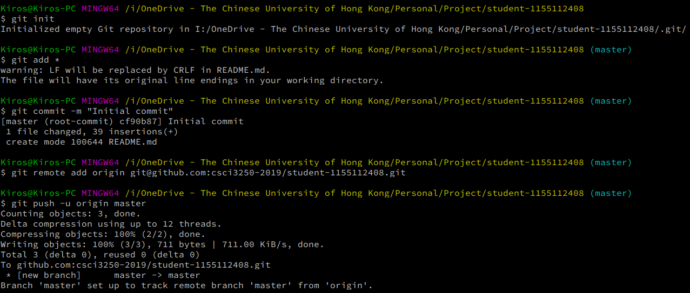

# A Little Bit About Myself??

Hi, I'm **Kiros**, a year one computer science  student.

## 3 Words To Describe Myself
* Ambivert
* Meticulous
* Self-learner

## Things I learnt and What I am going to learn

- [x] Native Android Development
- [x] Front End Development
- [x] TensorFlow
- [ ] Advanced Android Development
- [ ] Back End Development
- [ ] Cloud Deployment

## Skill set
| Proficiency -> |  |  |  |  |  |
|----------------|---|---|---|---|---|
| Java | X | X | X | X |  |
| JavaScript | X | X | X |  |  |
| HTML | X | X | X |  |  |
| CSS | X | X | X |  |  |
| C/C++ | X | X | X |  |  |
| Python | X | X |  |  |  |

## Screenshots

## Authors

* **Kiros Choi** - [KirosC](https://github.com/KirosC)

## Acknowledgement

* [Standard Readme](https://github.com/RichardLitt/standard-readme) - Standard Readme Style
